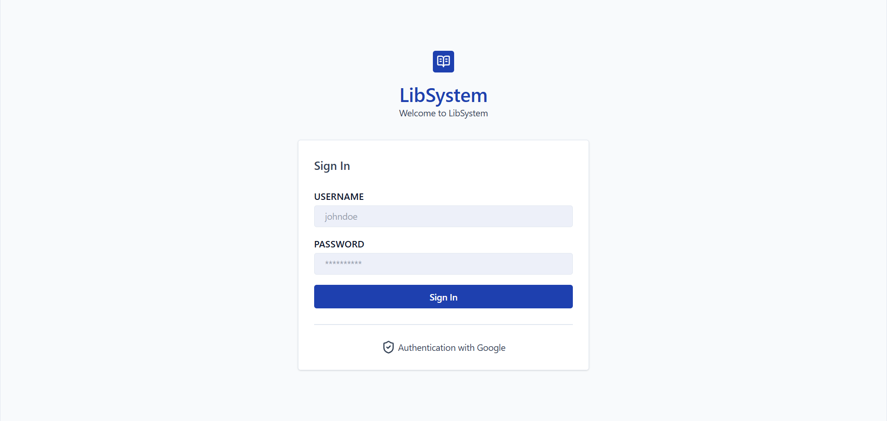
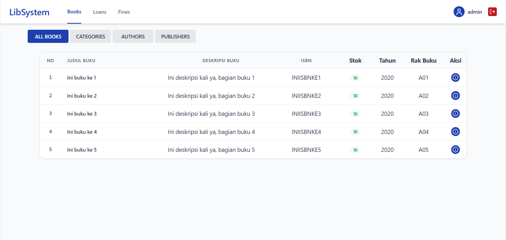
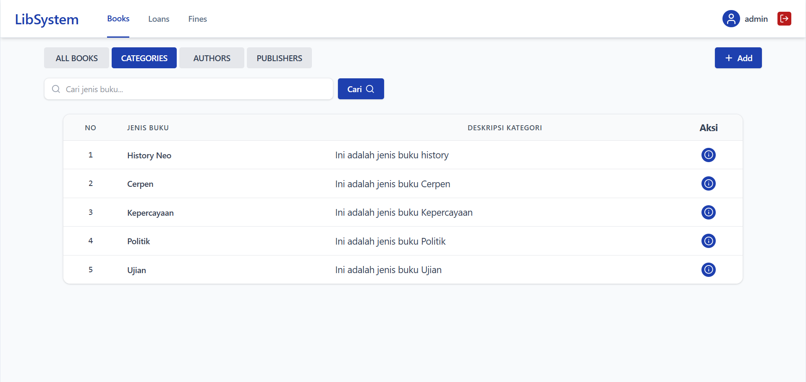
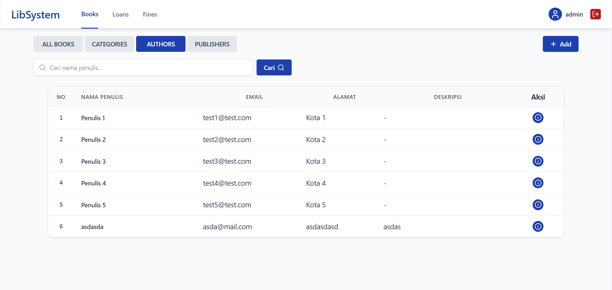
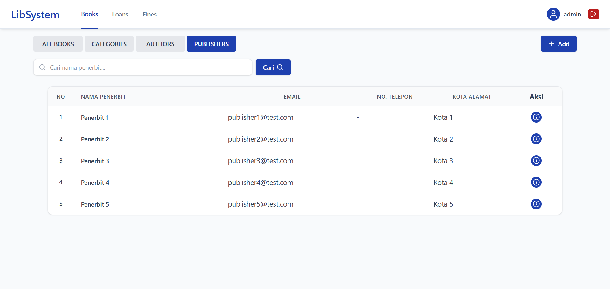
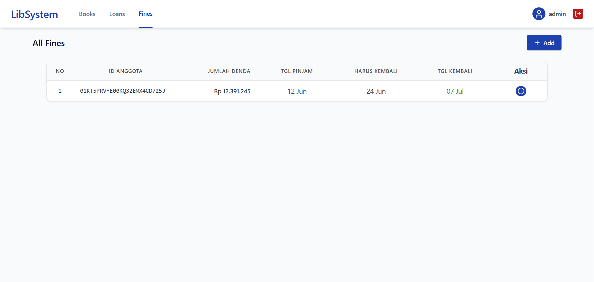
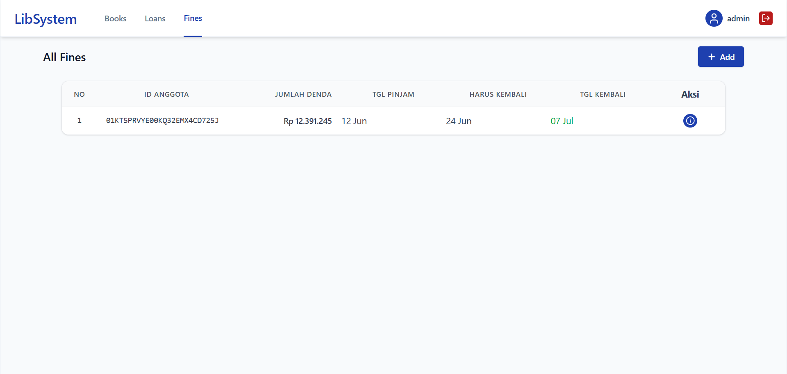

# Implementasi Frontend Library Management System

## Pendekatan Implementasi

Website dikembangkan menggunakan pendekatan **Feature-Based Architecture (Modular Architecture)**, di mana setiap domain bisnis dipisahkan ke dalam feature masing-masing seperti **Authentication**, **Books**, **Categories**, **Authors**, **Publisher**, **Loans**, dan **Fines**.

Navigasi utama aplikasi terdiri dari halaman **Books**, **Loans**, dan **Fines** yang dapat diakses melalui navbar. Pada modul Books, terdapat tab navigasi untuk mengelola **All Books**, **Categories**, **Authors**, dan **Publishers** dalam satu halaman sehingga memudahkan pengguna berpindah antar data master tanpa perlu berpindah route.

Setiap feature memiliki struktur yang konsisten yang mencakup:

- Service Layer (Axios API)
- TanStack Query Hooks
- Validation Schema (Zod)
- Type Definitions

State autentikasi dikelola menggunakan Zustand, termasuk penyimpanan token JWT dan fitur **logout** yang tersedia pada bagian kanan atas aplikasi. Komponen yang dapat digunakan kembali seperti tabel, modal, header, dan search bar ditempatkan pada folder shared components untuk meningkatkan reusability dan maintainability kode.

## Struktur Halaman

### Authentication

- `/auth/login`
  - Halaman login menggunakan JWT Authentication.

### Books

- `/books`
  - **All Books**: daftar dan detail buku.
  - **Categories**: CRUD kategori buku dan pencarian data.
  - **Authors**: CRUD penulis buku dan pencarian data.
  - **Publishers**: CRUD penerbit buku dan pencarian data.

### Loans

- `/loans`
  - Daftar, detail, tambah, ubah, dan hapus data peminjaman.

### Fines

- `/fines`
  - Daftar, detail, tambah, ubah, dan hapus data denda.

### Authentication

- `/auth/login`
  - Login menggunakan JWT Authentication.
  - Logout dan proteksi halaman menggunakan token JWT.

## Teknologi yang Digunakan

- React
- TypeScript
- Vite
- React Router DOM
- Axios
- TanStack Query
- Zustand
- React Hook Form
- Zod
- Tailwind CSS

## Screenshot / Demo

## Screenshots

### Authentication

#### Login Page

---

### Books

#### All Books

#### Categories

#### Authors

#### Publishers

---

### Loans

#### Loans Management

---

### Fines

#### Fines Management

